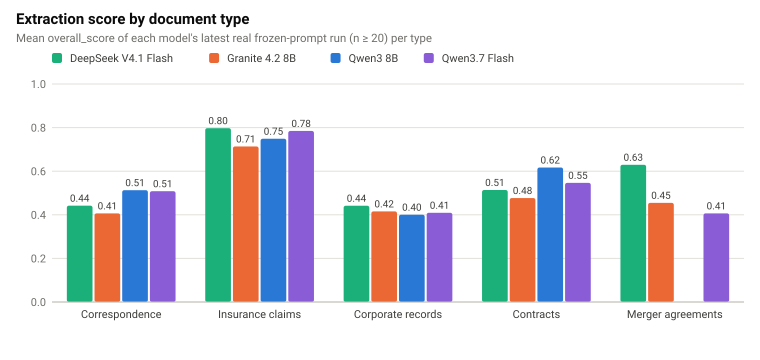
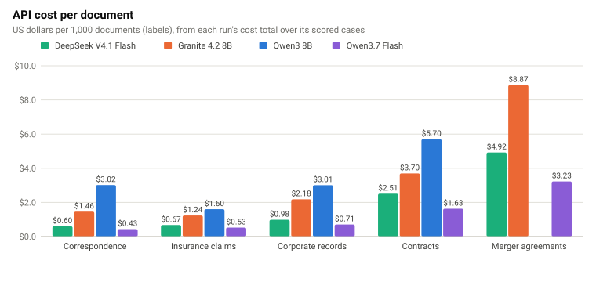
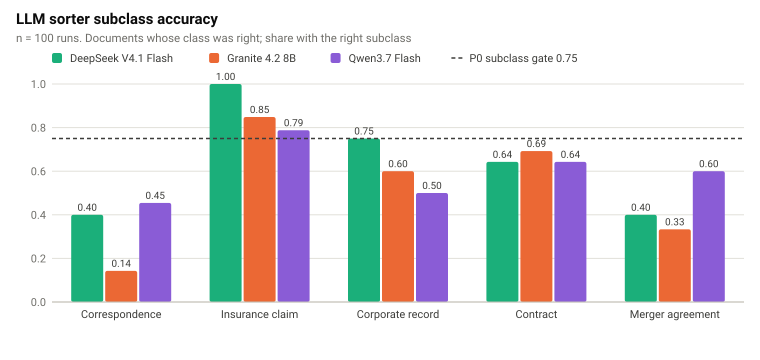
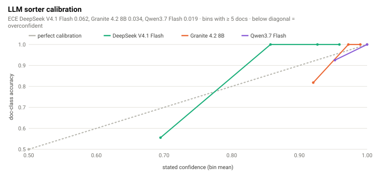
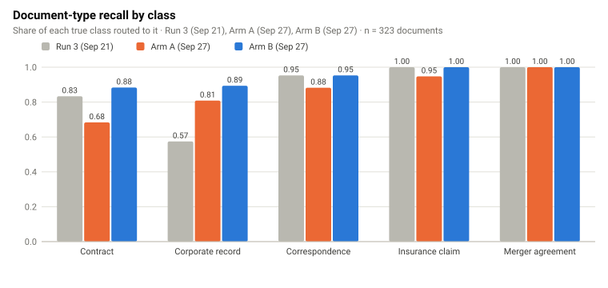
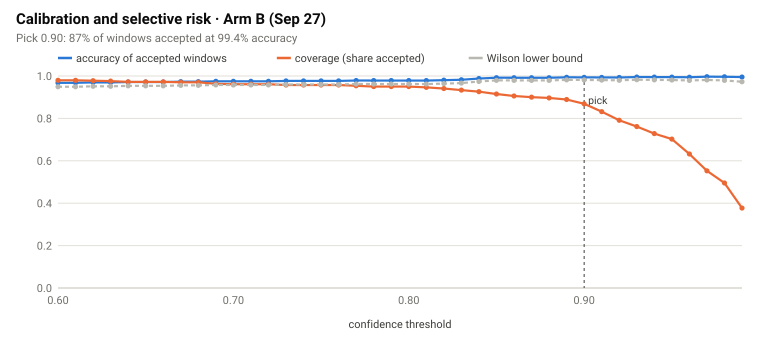
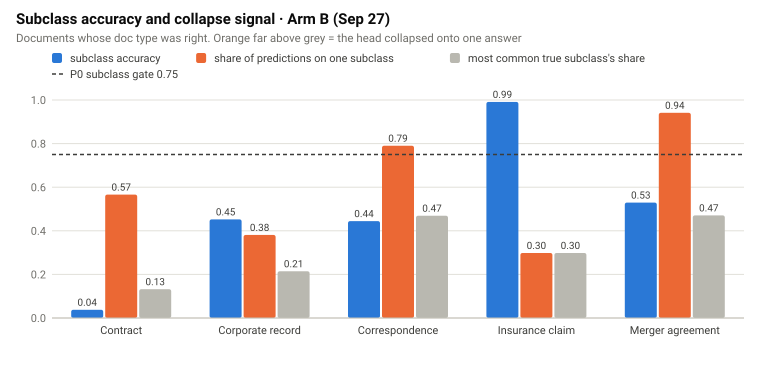

# Mailroom evaluation — master status and research report

_Data 16–28 Sep 2026 · generated by sandbox `reports/dashboard/export_hub_reports.py` from the cross-checked reports hub (1,376 source-quoted figures, 736 automated cross-checks, 8 documented source defects) · sources: local-mailroom-sandbox @ 8a931d00b068 · eval-environment @ f6bb5107e138 · mailroom-ml @ d3ad22263da0_

The mailroom classifies incoming legal documents and extracts fields with class-specific specialists. It has been evaluated on two serving legs:

- **API leg** (`LLM-Mailroom-Services/eval-environment`): hosted models through OpenRouter.
- **Modal + vLLM leg** (`Exios66/local-mailroom-sandbox`, SAND-032): self-hosted Qwen3-8B-AWQ on Modal L4 GPUs.

A third workstream trains the **ModernBERT intake classifier** (`LLM-Mailroom-Services/mailroom-ml`). All three use the public `Lucius-Morningstar/mailroom-dataset` (v9.1 = `ed7576b`, 3,302 rows).

Companions: [COST-COMPARISON-MODAL-VS-API.md](COST-COMPARISON-MODAL-VS-API.md) and [MODAL-VLLM-GPU-REPORT.md](MODAL-VLLM-GPU-REPORT.md). Live hub: `local-mailroom-sandbox/reports/dashboard/mailroom-reports.html`.

## 1. Status at a glance

| Front | Where it stands | Gate |
| --- | --- | --- |
| Specialist extraction (Modal, SAND-032) | Insurance 0.688 · corporate 0.458 · correspondence 0.300 · contracts CUAD micro-F1 0.596 · merger MAUD accuracy 8.5% | no extraction gate met; merger unsolved |
| Specialist extraction (API) | best per task: correspondence Qwen3-8B 0.513, insurance claims DeepSeek-V4.1-Flash 0.797, corporate records DeepSeek-V4.1-Flash 0.442, contracts Qwen3-8B 0.617, merger agreements Qwen3.7-Flash 0.521 | no model wins every task |
| Serving (Modal L4) | L5 posture frozen; 2×L4 scale-out at flat $/doc; SAND-032 spend $2.80 of $5.00 | ✓ within cap |
| LLM sorter | API n = 100: 91–95% class, 49–64% subclass; Modal S6 89.5% (n = 457) | subclass far below 75% |
| ModernBERT intake | Arm B 95.05% doc type, 58.3% subclass | ✓ P0 95% doc-type gate met · ✕ 75% subclass gate |

## 2. API leg — findings

| Task | Model | n | Score | $/doc | Wall | p95 call | Run |
| --- | --- | ---: | ---: | ---: | ---: | ---: | --- |
| Correspondence | DeepSeek-V4.1-Flash | 20 | 0.4419 | $0.00060 | 40.3 s | 14.4 s | `20260927T105317Z-eval-correspondence` |
| Correspondence | Granite-4.2-8B | 20 | 0.4065 | $0.0015 | 272 s | 147 s | `20260927T053647Z-eval-correspondence` |
| Correspondence | Qwen3-8B | 20 | 0.5130 | $0.0030 | 1,230 s | 151 s | `20260927T033031Z-eval-correspondence` |
| Correspondence | Qwen3.7-Flash (n = 50) | 50 | 0.4931 | $0.00045 | 322 s | 44.7 s | `20260928T090253Z-eval-correspondence` |
| Insurance claims | DeepSeek-V4.1-Flash | 20 | 0.7974 | $0.00067 | 107 s | 79.7 s | `20260927T105400Z-eval-insurance_claims` |
| Insurance claims | Granite-4.2-8B | 20 | 0.7135 | $0.0012 | 208 s | 122 s | `20260927T054211Z-eval-insurance_claims` |
| Insurance claims | Qwen3-8B | 20 | 0.7488 | $0.0016 | 203 s | 147 s | `20260927T035135Z-eval-insurance_claims` |
| Insurance claims | Qwen3.7-Flash (n = 50) | 50 | 0.7733 | $0.00051 | 308 s | 63.0 s | `20260928T070248Z-eval-insurance_claims` |
| Corporate records | DeepSeek-V4.1-Flash | 20 | 0.4415 | $0.00098 | 91.6 s | 16.9 s | `20260927T110828Z-eval-corporate_records` |
| Corporate records | Granite-4.2-8B | 20 | 0.4156 | $0.0022 | 509 s | 205 s | `20260927T065622Z-eval-corporate_records` |
| Corporate records | Qwen3-8B | 20 | 0.4004 | $0.0030 | 436 s | 338 s | `20260927T042239Z-eval-corporate_records` |
| Corporate records | Qwen3.7-Flash (n = 50) | 50 | 0.4178 | $0.00079 | 347 s | 97.5 s | `20260928T083627Z-eval-corporate_records` |
| Contracts | DeepSeek-V4.1-Flash | 20 | 0.5137 | $0.0025 | 362 s | 269 s | `20260927T105549Z-eval-contracts` |
| Contracts | Granite-4.2-8B | 20 | 0.4769 | $0.0037 | 666 s | 264 s | `20260927T054738Z-eval-contracts` |
| Contracts | Qwen3-8B | 20 | 0.6169 | $0.0057 | 1,458 s | 285 s | `20260927T035621Z-eval-contracts` |
| Contracts | Qwen3.7-Flash (n = 50) | 50 | 0.5462 | $0.0015 | 690 s | 203 s | `20260928T063713Z-eval-contracts` |
| Merger agreements | DeepSeek-V4.1-Flash | 20 | 0.2423 | $0.0038 | 393 s | 63.9 s | `20260927T110153Z-eval-merger_agreement` |
| Merger agreements | Granite-4.2-8B | 20 | 0.4548 | $0.0089 | 1,228 s | 580 s | `20260927T082404Z-eval-merger_agreement` |
| Merger agreements | Qwen3.7-Flash · frozen (filed as Qwen3-8B) | 20 | 0.3748 | $0.0029 | 142 s | 52.4 s | `20260927T022750Z-eval-merger_agreement` |
| Merger agreements | Qwen3.7-Flash (n = 50) | 50 | 0.5213 | $0.0032 | 488 s | 99.7 s | `20260928T070803Z-eval-merger_agreement` |

- **No hosted model wins every task.** DeepSeek-V4.1-Flash leads insurance claims and corporate records. Qwen3-8B leads correspondence and contracts. Among the N = 20 merger legs, Granite-4.2-8B scores highest, at the highest cost.
- **The production model, Qwen3.7-Flash, holds up at n = 50** (mutated prompt lineage) and is the cheapest or near-cheapest hosted model on every class. On mergers it scores 0.521, the best merger result on any route.
- **DeepSeek-V4.1-Flash is the cheapest across the five N = 20 tasks**: $0.171 in total vs $0.324 (Qwen3-8B, as filed, which includes the merger leg that ran on Qwen3.7-Flash) and $0.349 (Granite).

**LLM sorter (classification)**

| Run | Model | n | Class acc | Subclass acc | $/doc | ECE |
| --- | --- | ---: | ---: | ---: | ---: | ---: |
| 20260927T043145Z-eval-classification | Qwen3-8B | 20 | 70% | 5% | $0.0075 | — |
| 20260927T070900Z-eval-classification | Granite-4.2-8B | 20 | 90% | 60% | $0.0032 | — |
| 20260927T100340Z-eval-classification | Granite-4.2-8B | 100 | 94% | 49% | $0.0015 | 0.034 |
| 20260927T101020Z-eval-classification | Qwen3.7-Flash | 100 | 91% | 56% | $0.00085 | 0.019 |
| 20260927T101544Z-eval-classification | DeepSeek-V4.1-Flash | 100 | 95% | 64% | $0.0010 | 0.062 |

- On 100 documents every hosted sorter routes 91–95% of documents to the right class. The subclass is right only 49–64% of the time.
- Stated confidence is informative: Qwen3.7-Flash states its confidence most honestly (ECE 0.019); DeepSeek-V4.1-Flash is furthest off (0.062). Confidence can gate a fast path, but only for the class decision.

## 3. Modal + vLLM leg — findings

**Serving ladder.**

- The frozen **L5** posture cut wall time by 43.6% and cost per document by 43.5% against L0, at equal quality (0.2841 vs 0.2787).
- Throughput rose from 1,261 to 2,238 tok/s. The marlin kernel alone was reverted (quality drop).
- bf16 scored 0.2742 vs AWQ 0.2841, so there is no quality case for dropping AWQ.

**Scale-out and admission.**

- A second L4 ran 2.06× faster at flat cost per document.
- The seqs32 balanced fleet cut wall time on every class.

| Fleet (correspondence n = 100) | Wall | tok/s | p50 / p95 | $/doc | Score |
| --- | ---: | ---: | ---: | ---: | ---: |
| 1×L4 · c8 | 95.0 s | 2,579 | 6.86 / 11.59 s | $0.00021 | 0.2886 |
| 2×L4 · c16 | 46.1 s | 5,308 | 5.70 / 14.41 s | $0.00020 | 0.2966 |

| Workload | seqs16 fleet | seqs32 balanced | Speed-up |
| --- | ---: | ---: | ---: |
| correspondence n=100 | 46.1 s | 39.0 s | 1.18× |
| insurance n=50 | 60.7 s | 52.8 s | 1.15× |
| corporate n=50 | 56.3 s | 48.6 s | 1.16× |
| contracts n=50 | 234 s | 220 s | 1.07× |

**Five-class sweep (2×L4, c32, n = 50).**

| Class | Run | Done | Metric | Headline | Overall | Schema | Wall | p50 / p95 | tok/s | $/doc |
| --- | --- | --- | ---: | ---: | ---: | ---: | ---: | ---: | ---: | ---: |
| Correspondence | `sand032-s3-corr50` | 50/50 | overall extraction score | 0.3004 | 0.3004 | 98% | 16.0 s | 6.8 / 12.9 s | 7,395 | $0.00014 |
| Insurance claims | `sand032-s3-insurance50` | 50/50 | overall extraction score | 0.6881 | 0.6881 | 22% | 60.7 s | 19.7 / 34.1 s | 3,042 | $0.00054 |
| Corporate records | `sand032-s3-corporate50` | 50/50 | overall extraction score | 0.4583 | 0.4583 | 94% | 56.3 s | 28.9 / 55.1 s | 4,692 | $0.00050 |
| Contracts | `sand032-s3-contracts50` | 47/50 | CUAD clause-detection micro F1 | 0.5960 | 0.6011 | 100% | 234 s | 85.8 / 167.5 s | 1,616 | $0.0022 |
| Merger agreements | `sand032-s5-merger50-maud` | 46/50 | MAUD per-question micro accuracy | 0.0848 | 0.0830 | 100% | 442 s | 183.4 / 315.2 s | 1,383 | $0.0043 |

- A contract or merger takes 13–27× longer than a letter.
- Output length drives latency 2.6× more than input length.
- Insurance's 22% schema validity costs nothing in score.
- Mergers remain unsolved: the MAUD prompt doubled per-question accuracy from 4.0% to 8.5%, but coverage is only 33%.

**Completion reliability.** Short documents never fail. Long contracts and mergers lose 6–12% of documents.

| Run | Completed | Errored | Not attempted | Cause |
| --- | ---: | ---: | ---: | --- |
| Merger agreements · SAND-032 | 46 | 4 | 0 | LengthFinishReasonError |
| Contracts · SAND-032 | 47 | 3 | 0 | LengthFinishReasonError |
| Insurance · Qwen AWQ | 20 | 0 | 0 | — |
| Corporate · Qwen AWQ | 20 | 0 | 0 | — |
| Correspondence A · Qwen AWQ | 20 | 0 | 0 | — |
| Correspondence B · Qwen AWQ | 50 | 0 | 0 | — |
| Correspondence c5 · Qwen AWQ | 20 | 0 | 0 | — |
| Correspondence c8 · Qwen AWQ | 20 | 0 | 0 | — |
| Contracts c4 · Qwen AWQ | 18 | 2 | 0 | 400 context overflow (16k window) and LengthFinish at 4,096 tokens |
| Contracts c8 · Qwen AWQ | 17 | 3 | 0 | LengthFinishReasonError at 8,192 tokens |
| Merger · Qwen AWQ | 15 | 5 | 0 | Transient connection drops at c=8 |
| Contracts · Qwen bf16 | 6 | 14 | 0 | Pre-AWQ run; error detail not archived |
| Merger · Granite | 11 | 5 | 4 | Thinking text broke the JSON parse; cost-cap abort |
| Correspondence-50 · Granite | 5 | 0 | 45 | Stopped on pace: projected cost over the cap |
| Contracts · Granite | 0 | 8 | 12 | Operator halt: output budget spent on thinking |

**Prompt v2 (eval-environment GEPA) on Qwen3-8B-AWQ, paired 50.** Correspondence v2 is promoted. Insurance and corporate records are held.

| Class | v2 (75) | v2 (paired 50) | production (paired 50) | Δ paired | better / worse | schema v2 / prod | Verdict |
| --- | ---: | ---: | ---: | ---: | ---: | ---: | --- |
| correspondence | 0.3446 | 0.3419 | 0.3004 | **+0.0415** | 22 / 12 | 1.00 / 0.98 | **PROMOTE** |
| insurance_claim | 0.6675 | 0.6832 | 0.6881 | −0.0049 | 8 / 17 | 0.24 / 0.22 | HOLD |
| corporate_record | 0.4689 | 0.4479 | 0.4583 | −0.0104 | 6 / 8 | 0.94 / 0.94 | HOLD |

**Isolated LLM sorter on Modal (S6).** Accuracy 89.5% on 457 documents, macro-F1 0.8635, $0.0017/doc. Mergers are under-recalled, and corporate records leak into contracts.

| Class | n | Precision | Recall | F1 |
| --- | ---: | ---: | ---: | ---: |
| contract | 181 | 0.796 | 0.994 | 0.885 |
| corporate_record | 136 | 0.990 | 0.743 | 0.849 |
| correspondence | 41 | 1.000 | 0.951 | 0.975 |
| insurance_claim | 81 | 0.988 | 1.000 | 0.994 |
| merger_agreement | 18 | 1.000 | 0.444 | 0.615 |

## 4. ModernBERT intake classifier

| Checkpoint | Evaluated | Doc-type acc | Subclass (conditional) |
| --- | --- | ---: | ---: |
| run-2 (trainer test) | 20 Sep | 93.19% | — |
| run-3 (GPU harness) | 21 Sep | 89.47% | 52.6% |
| run-3 (re-evaluated) | 27 Sep | 92.57% | 51.2% |
| Arm A (1 epoch) | 27 Sep | 86.38% | 48.4% |
| Arm B (3 epochs) | 27 Sep | 95.05% | 58.3% |

- **Arm B is the first checkpoint over the 95% P0 doc-type gate.** It lifted corporate records from 57% to 89%.
- **Subclass stays at 58.3%, below its 75% gate.** Contracts hold it down (2/53 of contract subclasses right).
- **Selective prediction works.** At threshold 0.9 Arm B accepts 86.9% of windows at 99.36% accuracy (window ECE 0.0259). 30.3% of documents take the fast path, and 98/98 of them were routed correctly.
- Document length does not explain routing errors.

## 5. Cross-leg verdict

1. **Sort with ModernBERT.** It matches the best hosted LLM sorter's document-type accuracy at about three orders of magnitude lower cost. Keep the LLM sorter only behind the confidence gate, and fix subclass before relying on either for it.
2. **Extract via the API for insurance claims, contracts and mergers.** The cheapest hosted model costs less per document than Modal on all three. It also scores higher on insurance claims and mergers; contracts are scored differently on the two legs.
3. **Correspondence and corporate records can run on Modal** when batches are large enough to amortise the cold boot (312 documents for correspondence and 336 documents for corporate records). Modal is cheaper per document for both, but hosted models still score higher on correspondence.
4. **The quality ceiling is the prompt and scorer, not the serving.** Serving work cut cost per document 2.4–15×. Prompts moved correspondence by +0.04 (v2), and no configuration fixes mergers or subclass.

## 6. Documented source defects

| Key | Defect |
| --- | --- |
| `correspondence_a.latency_sum` | Run A's per-document latency column sums to 496.7 s, but the report's run-level sum is 503.4 s (the serving export agrees: latency_sum_seconds 503.369, p50 26.595 s vs a per-row median of 26.0 s). The report says its per-document rows were reconstructed from captured stdout; scores in the same table do match the stated mean. Latency dots for Run A come from that table. |
| `sand032-s5-merger50-maud.summary_usd` | The SAND-032 program summary lists the MAUD-prompt merger run at $0.005461/doc; its run report gives $0.004275/doc. The summary row used the serving export, which also bills the run's 122.8 s cold boot (0.251214 vs 0.196653 USD over 46 docs); every other row is busy-window only. This page uses the busy-window figure. |
| `sand032-s6-sorter1000.usd_basis` | The S6 sorter report gives $0.001869/doc. That is the serving export's billed figure, which includes the run's 130.6 s cold boot; every other SAND-032 $/doc is busy-window only. On that basis S6 costs $0.001742/doc, which this page uses. |
| `api.qwen_merger_model` | eval-environment files the merger leg under Qwen3-8B, but the logged model is qwen/qwen3.7-flash. It is shown here as its own model. |
| `api.deepseek_cls_wall` | The DeepSeek-V4.1-Flash n=100 classification run logs a 4.8 s wall time but a 32.0 s p95 call latency, which cannot both be true. Its runtime is not charted. |
| `mb.armB.coverage_field` | mailroom-ml Arm B eval JSON: selective_risk.coverage is 0.3771, which is the last sweep row (threshold 0.99, coverage 0.3771), not the recommended 0.9 threshold (0.8688). The page reads the recommended row. |
| `mb.run3.coverage_field` | mailroom-ml run-3 eval JSON has the same exporter defect: coverage 0.4325 is the 0.99 row; at the recommended 0.93 threshold coverage is 0.7321. |
| `mb.plus_invalid` | The held-out-plus eval (1,323 docs, doc_type accuracy 0.0128) is invalid: on the 323 canonical test documents it contains, it gets 17 right where the same checkpoint's canonical run gets 307. Its slice table also assigns all docs to the canonical slice. It is excluded from the charts. |

## 7. Report audit (this sweep)

Every committed SVG in the three repositories was rendered in Chromium and checked text box by text box, for overflow past the figure edge and for overlapping labels. Every relative link and image in their tracked markdown was resolved.

| Repository | SVGs | Overflow | Collisions | Markdown files | Broken links | Unreferenced figures |
| --- | ---: | ---: | ---: | ---: | ---: | ---: |
| local-mailroom-sandbox | 51 | 0 | 0 | 154 | 0 | 0 |
| eval-environment | 15 | 0 | 0 | 348 | 0 | 0 |
| mailroom-ml | 22 | 0 | 0 | 31 | 0 | 0 |

Fixes made in this sweep:

- **local-mailroom-sandbox:** `scripts/sand032/viz.py` sizes label columns by measured text width (long subclass names overflowed the left edge on contracts and corporate latency/subclass figures), puts reference-line labels in their own lane (p50/p95 labels collided with each other and with the subtitle) and spaces dumbbell legends by measured width; new `scripts/sand032/rerender.py` re-laid all 51 SAND-032 figures from their embedded data, asserting the data is unchanged. The reports hub no longer crashes on eval-environment log rows without `run_id`, is synced to eval-environment `ef8c448` / mailroom-ml `640610d`, cross-checks the Qwen3.7-Flash n = 50 legs, and gains a Modal vs API tab. Broken relative links fixed in docs, CHANGELOG, RUN-20 serving reports and agent prompts.
- **eval-environment:** `src/evals/viz/svgcharts.py` wraps long subtitles (the calibration subtitle overflowed the right edge), lays legends out by measured width with the reference-line key inside the legend (the subclass legend collided with value labels), measures bar and heatmap labels, and raises confusion-matrix text from 9.5 px to 10 px; all 15 `web/data/charts` figures regenerated. Broken link in the RUN-03 ModernBERT held-out report fixed. `render_comparison_reports.py` now covers Qwen3.7-Flash, and the missing `reports/api-comparisons/qwen3.7-flash/README.md` suite summary is added (12 canonical stems; every row matches its canonical report).
- **mailroom-ml:** `src/mailroom_ml/viz/svgcharts.py` gets the same layout fixes (the `ale_windows` tick labels collided with the axis title, `subclass_collapse` axis title collided with the 1.00 tick, confusion text was 9.5 px); both chart galleries (Run 3 / Arm A / Arm B and Arm A) regenerated from the committed eval JSON.

Still open:

- eval-environment `reports/api-comparisons/granite-4.2-8b/README.md` and `deepseek-v4.1-flash/README.md` are stale: they predate canonical runs whose reports are committed (the Granite n = 100 sorter; the DeepSeek 28 Sep specialist re-runs and n = 50 merger). Re-render them with `python scripts/render_comparison_reports.py` on the machine that holds `data/experiments/`, which recomputes costs from case rows.
- Merger agreements are the weakest extraction class on every route (master report §2 and §3).
- Sorter subclass accuracy (LLM and ModernBERT) is below the 75% gate on every route.
- Pre-existing environment-only test failures in all three repos (missing `huggingface_hub`, sibling checkpoints, proxy-blocked downloads); none are caused by this sweep and each fails identically on `main`.

## Sources

- `Exios66/local-mailroom-sandbox` @ `8a931d00b068`
- `LLM-Mailroom-Services/eval-environment` @ `f6bb5107e138`
- `LLM-Mailroom-Services/mailroom-ml` @ `d3ad22263da0`
